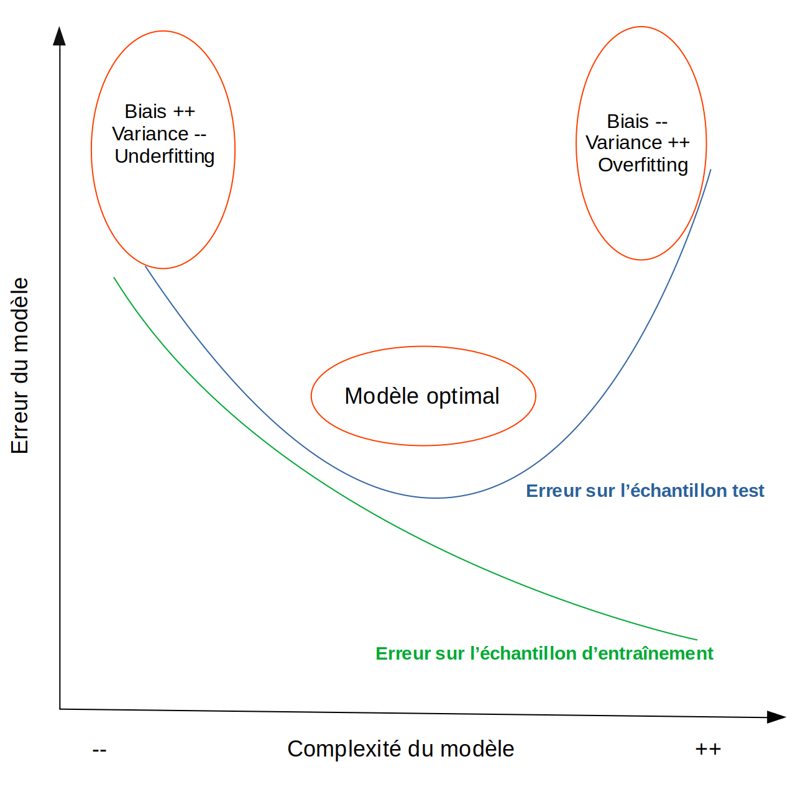

```{r setup, include=FALSE}
knitr::opts_chunk$set(collapse = TRUE)
source("code_article_biais_variance.R")
```

[TOC]\
Dans cet article, s'attaque à un problème fondamental dans la modélisation des données : l'arbitrage biais/variance. Ce concept est souvent évoqué pour caractériser les enjeux de la construction d'un modèle de prédiction performant, mais pas toujours explicité. L'idée est d'essayer de donner au lecteur les outils théoriques de cette question en privilégiant une approche intuitive du problème, et on l'espère accessible à tous. Après avoir défini ce que sont le biais et la variance, on présente les enjeux de cet arbitrage puis l'application concrète dans le cas de l'entraînement d'un modèle de Machine Learning.

# Que sont le biais et la variance?

Pour expliquer le plus simplement possible ces concepts, on se place dans le contexte de l'observation de deux variables `Y` et `X`. Dans le cas d'une modélisation d'une relation entre X et Y, le biais d'un estimateur est son écart avec sa "vraie" valeur si on observait parfaitement la relation entre ces variables. On entend donc le biais comme __l'écart entre la fonction modélisée et la fonction théorique__ qui permettrait de restituer parfaitement le lien observé entre X et Y. 

Une manière de jouer sur le biais d'un modèle c'est de modifier sa variance. La variance est une mesure de dispersion de valeurs, qui donne une estimation de l'écart de celles-ci à leur moyenne. La variance d'un modèle estime **à quel point celui-ci fluctue autour de sa moyenne pour coller aux données**. Une mesure utilisée couramment dans le cas des régressions linéaires est le coefficient de détermination R2. Celui-ci calcule **la part de la variance des données expliquée par la variance du modèle**. Autrement dit, plus mon modèle sera proche des points de mes données, plus sa variance et donc le R2 seront élevés. Pour illustrer ce concept, on présente plusieurs modèles appliqués au même jeu de données avec une variance plus ou moins élevée :

```{r echo=FALSE}
plot_0 + plot_1 + plot_2
```

Pour chaque modèle, la courbe du modèle est celle qui apparaît en rouge et on a mis en évidence en vert la projection de chaque point sur sa valeur prédite par le modèle. Voyons comment interpréter ces graphiques :\
- Le 1er modèle est un modèle basique qui se contente de prédire que pour chaque valeur de X, Y sera égale à sa moyenne. Par définition donc, sa variance est nulle et sa capacité prédictive faible.\
- Le second modèle est une régression linéaire simple qui a un R2 d'environ 50%. Il a donc une meilleure qualité prédictive que le premier modèle du fait qu'il capte une partie de la variance des données, ici à travers une corrélation positive entre X et Y.\
- Le troisième modèle est un modèle polynomial dont on voit qu'il est plus ajusté que le second. Les points prédits (en vert) par la courbe sont en effet plus proche des points que pour le précédent modèle et mécaniquement cela fait augmenter le R2. Le fait d'utiliser un modèle polynomial a donné au modèle une plus grande souplesse ce qui lui a permis de se rapprocher de certains points extrêmes qui étaient éloignés de la droite de régression du second modèle.\  

Ainsi, plus la variance augmente, plus le modèle prédit en moyenne des valeurs proches de leurs vraies valeurs, ce qui fait diminuer le biais, puisqu'il est défini comme l'écart entre notre fonction de prédiction et une fonction qui permettrait de prédire parfaitement les données observées.  


# Enjeux de l'arbitrage biais/variance

D'après ce qu'on a vu, pourquoi alors ne pas simplement chercher à maximiser la variance pour minimiser le biais, c'est-à-dire son écart aux vraies valeurs? Tout simplement parce que dans le cas de la construction d'un modèle de prédiction, nous modélisons des relations entre des données à partir d'un échantillon pour prédire un résultat sur une nouvelle population. C'est donc la performance de ce modèle sur de nouvelles données qui va nous intéresser. Or, comme vous avez pu le pressentir en observant les graphiques précédents, __un modèle avec une variance très élevée se généralise mal à de nouvelles données__. D'un autre côté, __un modèle avec une faible variance aura lui aussi une qualité prédictive très faible__ car il captera mal une éventuelle relation entre les variables.

Tout le problème de cet arbitrage (ou dilemme) biais-variance est donc de **trouver un modèle qui ait une variance suffisamment forte pour limiter le biais mais suffisamment faible pour qu'il soit généralisable**. Les modèles précédents avaient été entraînés sur une base de données qui était un échantillon aléatoire correspondant à 10% des données d'un échantillon plus important. Pour mesurer la qualité prédictive de ces modèles on les applique donc aux données entières et on calcule l'écart moyen au carré de la prédiction à la vraie valeur, c'est-à-dire l'erreur quadratique moyenne ou en anglais **MSE** pour *Mean Squared Error* :

```{r echo=FALSE}
plotb_0 + plotb_1 + plotb_2
```

On constate que, comme attendu, le modèle avec le plus de variance se généralise mal à des données non connues et présente une erreur de prédiction supérieure à celle du modèle linéaire simple. En effet, les variations de la courbe polynomiale qui lui permettait de coller au plus près des données sur lesquelles elle a été construite entraîne beaucoup de prédictions très éloignées de la vraie valeur des nouvelles données.  
L'erreur attendue d'un modèle de prédiction sur des données sur lesquelles il ne s'est pas entraîné peut en effet se décomposer en __la somme du biais au carré et de la variance de ce modèle, c'est la décomposition biais-variance de l'erreur quadratique__. Comme le biais diminue avec la variance, il faut donc trouver un niveau de complexité du modèle qui permette à la fois de minimiser l'écart à la vraie valeur (faible biais en augmentant la variance) et d'être généralisable en dehors de son échantillon d'entraînement (faible variance).

# Liens avec l'overfitting et l'underfitting dans les modèles de Machine Learning

## Appelons un chat un chat

Le principe de l'apprentissage automatique supervisé est le même que celui qu'on a présenté jusqu'à maintenant : on renseigne au modèle des variables explicatives (X) et une variable d'intérêt (Y) qu'on aimerait pouvoir ensuite prédire à partir de nouvelles données X. Par exemple, on renseigne des photos de chats et de chiens étiquettées : Y est alors le label "chien" ou "chat" de la photo, X la matrice de pixels de la photo. Le modèle devra être ensuite capable de prédire à partir d'une photo qu'il n'a jamais vue si celle-ci représente un chat ou un chien. Pour mesurer la qualité prédictive de notre modèle, on réserve des données labellisées sur lesquelles il ne s'entraînera pas. On va ensuite lui demander de prédire les labels déjà connus de ces données, ce qui va nous permettre d'évaluer la qualité de ces prédictions. Cet échantillon est en général appelé **échantillon test** (*test set* en anglais), et les données sur lesquelles le modèle est entraîné s'appelle l'**échantillon d'entraînement** (*train set*). En général, si l'on dispose de suffisamment de données, on n'aura pas trop de mal à construire un modèle qui parviendra à labelliser quasiment parfaitement **nos données d'entraînement**. Tout le problème est d'avoir un modèle qui se généralise correctement à de nouvelles données.

## Courbe d'apprentissage d'un modèle

Pour schématiser, imaginons que dans les données d'entraînement les chiens soient en général photographiées à l'extérieur et les chats à l'intérieur. Si mon modèle a une forte variance, cela signifie qu'il va prendre en compte beaucoup de détails de la photo. Il va par exemple donner du poids aux éléments de fond dans sa prédiction et sera incapable de labelliser correctement un chien photographié à l'intérieur. Un modèle bien plus basique qui se serait appuyé par exemple uniquement sur la forme des oreilles de l'animal aurait peut-être de meilleurs résultats.\
Dans le premier cas, on dit que l'on est dans une situation de **surapprentissage, ou overfitting**. Le modèle a intégré des éléments anecdotiques, du bruit, dans son processus décisionnel et cela va réduire sa performance prédictive sur des données non connues. Autrement dit, **sa variance est trop élevée**. Si au contraire le modèle est trop peu complexe et n'a pas intégré assez d'informations pour différencier un chat d'un chien même sur les données d'apprentissage, on dit qu'il est dans un état de **sous-apprentissage, ou underfitting**.\
Dans les deux cas, le modèle va avoir de mauvaises performances prédictives sur des nouvelles données. Ce constat peut être schématisé de la manière suivante :

  

Notons bien ici que cette relation entre complexité du modèle et décomposition de l'erreur de prédiction s'entend __à taille d'échantillon fixée__. Ainsi, plus l'échantillon sera grand, plus le modèle pourra être complexe avant d'entrer dans la phase de surapprentissage.  

# Conclusion  
Dans le cadre d'une __démarche prédictive__, il est donc tout à fait naturel de limiter l'apprentissage du modèle pour optimiser ses capacités prédictives. Cela peut être fait en réduisant le nombre de variables prédictives utilisées, en limitant le nombre de couches de neurones dans un réseau, mais aussi en utilisant des méthodes de réduction des dimensions, comme [nous vous l'avions montré avec l'analyse en composantes principales](https://blog.statoscop.fr/acp-python.html). Bien sûr, dans une __démarche explicative__, il sera au contraire normal de sacrifier éventuellement une meilleure capacité prédictive pour mettre en évidence une relation avec une variable explicative. Si vous souhaitez aller plus loin, vous pouvez parcourir l'excellente étude de [Shmueli, 2010](https://www.stat.berkeley.edu/~aldous/157/Papers/shmueli.pdf) qui expose les enjeux croisés des démarches explicative et prédictive dans la modélisation.  
Il me reste à remercier [Emmanuel Paroissien](https://twitter.com/EParoissien), brillant chercheur de l'Inra, pour nos échanges qui m'ont aidé à construire cette note. N'hésitez pas à [visiter notre site](https://www.statoscop.fr) et à nous suivre sur [Twitter](https://twitter.com/stato_scop) et [Linkedin](https://www.linkedin.com/company/statoscop). Pour retrouver le code ayant servi à générer cette note, vous pouvez vous rendre sur le [github de Statoscop](https://github.com/Statoscop/notebooks-blog).  
