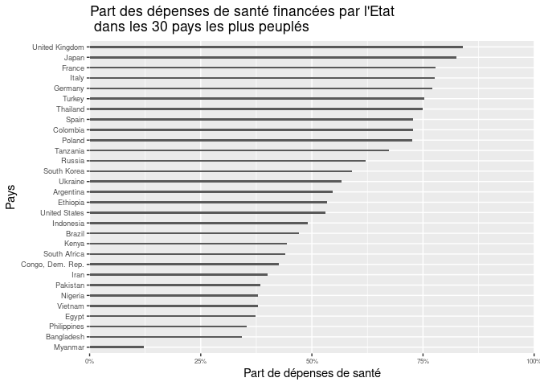

Dans cette note nous proposons un petit cas pratique pour illustrer la mise en forme d'un graphique en colonnes, ou barplot, avec le package R `ggplot2`. On s'appuie pour cela sur les données de la [fondation Gapminder](https://www.gapminder.org/) en s'intéressant à la part des dépenses de santé financées par l'Etat dans les 30 pays les plus peuplés au monde.  

# Créer notre premier graphe avec `geom_col`  

Notre objectif dans cet exemple est d'afficher le taux de dépenses de santé financées par l'État pour chaque pays présent dans la base. Ce barplot se réalise avec `ggplot2` à l'aide de `geom_col`. En effet, nous voulons représenter la valeur d'une variable (ce taux de dépenses) pour chaque modalité donnée d'une variable catégorielle (le pays). Si nous avions voulu représenter le nombre de fois où une variable catégorielle apparaît dans la base, nous aurions utilisé `geom_bar`.  
Avec ces éléments, le premier graphique qui nous viendrait à l'esprit en utilisant `ggplot2` serait le suivant :  


```r
df_health %>% 
  ggplot(aes(x = country, y = gvt_health_exp_10)) + 
  geom_col()
```

<!-- -->

Il est bien sûr illisible, en raison notamment du grand nombre de pays représenté et du fait que leurs noms ne peuvent pas s'afficher correctement sur l'axe des abscisses. On peut corriger ça en faisant une rotation de l'étiquette des axes de 90° avec `theme(axis.text.x = element_text(angle = 90))`. Les barres sont également trop rapprochées, ce que l'on va corriger avec le paramètre `width` de `geom_col`. On obtient avec ces réglages rapides le graphique suivant :  


```r
df_health %>% 
  ggplot(aes(x = country, y = gvt_health_exp_10)) + 
  geom_col(width = 0.5) + 
  theme(axis.text.x = element_text(angle = 90))
```

<!-- -->

C'est déjà mieux! Mais il reste un peu de travail pour faciliter la lecture de ce graphique.  

# Mettre en forme le graphique  

Pour rendre ce graphique plus agréable à lire et plus compréhensible, on propose d'ordonner l'affichage en fonction de la valeur du résultat, de mettre en forme et d'inverser les axes et enfin de changer quelques éléments graphiques.  

## Ordonner l'affichage en fonction de la valeur de la variable d'intérêt   

Un élément important de ce graphique est que les pays sont présentés dans l'ordre alphabétique, ce qui n'a pas d'intérêt pour le lecteur. On peut facilement changer l'ordre d'affichage des modalités de l'axe des abscisses en le conditionnant aux valeurs de l'axe des ordonnées. On utilise pour cela dans l'instruction `aes()` la fonction `reorder()` au moment de la définition du `x`, qui nous permet de l'ordonner de manière croissante ou décroissante en fonction de notre variable d'intérêt :  


```r

# par ordre croissant 
df_health %>% 
  ggplot(aes(x = reorder(country, gvt_health_exp_10), y = gvt_health_exp_10)) + 
  geom_col(width = 0.5) + 
  theme(axis.text.x = element_text(angle = 90))  

# par ordre décroissant
df_health %>% 
  ggplot(aes(x = reorder(country, -gvt_health_exp_10), y = gvt_health_exp_10)) + 
  geom_col(width = 0.5) + 
  theme(axis.text.x = element_text(angle = 90))
```


Il est maintenant bien  plus facile de situer chaque pays par rapport aux autres.  

## Mise en forme des axes  

Il reste que la lecture des pays n'est pas facile ainsi, on préfère donc intervertir les axes des `x` et des `y`. Cela se fait très simplement avec `coord_flip()`. On en profite également pour ajuster la taille des labels et ajouter les titres des axes dans `labs()`. Enfin, on fait apparaître la part de dépenses en pourcentage sur l'axe correspondant avec l'instruction `scale_y_continuous` de `ggplot2` et la fonction `percent` du package `scales` : 


```r
df_health %>% 
  ggplot(aes(x = reorder(country, gvt_health_exp_10), y = gvt_health_exp_10)) + 
  geom_col(width = 0.2) + 
  coord_flip() + 
  theme(axis.text.y = element_text(size = 6)) + 
  labs(x = "Pays",
       y  = "Part de dépenses de santé") + 
  scale_y_continuous(labels = ~ scales::percent(., accuracy = 1)) -> plot_health

plot_health
```

<!-- -->

## Utilisation d'un thème de ggplot2  

Pour l'affichage graphique il est possible de régler chaque élément du graphgique comme on le souhaite. Le plus facile reste cependant d'utiliser les nombreux thèmes existants disponibles. Pour les utiliser il suffit d'ajouter l'instruction `theme_*` à la suite de votre plot. Le thème par défaut dans ggplot2 est `theme_gray`. On vous présente le résultat donné par quelques autres :  


C'est la fin de cet article! N'hésitez pas à [visiter notre site](https://www.statoscop.fr) et à nous suivre sur [Twitter](https://twitter.com/stato_scop) et [Linkedin](https://www.linkedin.com/company/statoscop). Pour retrouver l'ensemble du code ayant servi à générer cette note, vous pouvez vous rendre sur le [github de Statoscop](https://github.com/Statoscop/notebooks-blog).  
