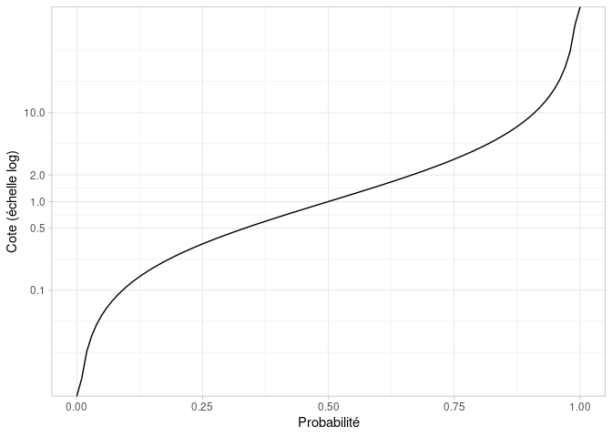

[TOC]\

Dans cet article, on s'intéresse à la relation entre probabilités et cotes et aux implications concernant deux indicateurs souvent utilisés pour comparer le risque d'un évènement entre différents groupes d'individus : les risques relatifs (RR) et les odds ratios (OR). 
 
# Probabilités et cotes  

## Définitions  

La __probabilité__ correspond à la vraisemblance d'un évènement. Elle est comprise entre 0 (évènement impossible) et 1 (évènement certain). On peut estimer une probabilité d'un évènement à partir de sa __fréquence__, au sens du rapport entre __le nombre de fois où cet évènement est observé__ et le __nombre d'observations total__ dont on dispose. En épidémiologie, on parle aussi de __prévalence__. Ainsi, si l'on constate par exemple à un instant T que pour 100 personnes 20 sont atteintes d'une maladie, on en concluera que la __prévalence de cette maladie__ est de 20%. On peut aussi en déduire que la probabilité qu'un individu tiré au hasard ait cette maladie est de 20%.  
La __cote__ d'un évènement est le rapport entre __le nombre de fois où cet évènement est observé__ et le __le nombre de fois où cet évènement n'est pas observé__. Pour notre maladie dont la prévalence est de 20%, la cote est donc 20/80, car sur 100 personnes 20 ont la maladie et 80 ne l'ont pas. Notre cote est ainsi de 0,25. Si la probabilité avait été de 50%, la cote aurait été de 1 (50/50) et si la probabilité avait été de 1, la cote aurait été de... l'infini (100/0). Les cotes vont ainsi de 0 à l'infini. 

## Lien entre cote et probabilité  

Les valeurs des cotes de __0 à 1__ correspondent aux __évènements qui ont moins de chances d'arriver que de ne pas arriver__ et ceux de __1 à l'infini__ aux __évènements qui ont plus de chances d'arriver que de ne pas arriver__.   
On peut représenter le lien entre une probabilité et sa cote, en n'oubliant pas de passer l'axe représentant la cote en __échelle logarithmique__. En effet, c'est ici cette échelle qui va permettre de rendre compte visuellement de la symétrie des valeurs entre 0 et 1 et de celles entre 1 et l'infini :  

Ainsi, une cote de 0,5 correspond à __deux fois moins de chances__ que l'évènement arrive plutôt qu'il n'arrive pas et une cote de 2 correspond à __deux fois plus de chances__ que l'évènement arrive plutôt qu'il n'arrive pas. C'est le même raisonnement pour 0,1 et 10 (10 fois plus ou moins de chances), pour 0,01 et 100 (100 fois plus ou  moins de chance), etc...  

Les cotes se déduisent donc directement des probabilités. Mais lorsque l'on compare plusieurs populations, le choix de l'un ou l'autre des indicateurs va avoir une influence sur le résultat obtenu.    

# Risques relatifs et odds ratios   

## Interprétations

Les risques relatifs (RR) et les odds ratios (OR) sont utilisés pour __comparer le risque d'un évènement entre plusieurs populations__. Reprenons notre exemple de la maladie dont la prévalence est de 20% dans la population. Imaginons qu'on observe en fait que cette prévalence varie fortement selon le sexe, et qu'elle est de 10% chez les hommes et de 30% chez les femmes.  
Le risque relatif pour une femme par rapport à un homme est __le rapport de la probabilité pour une femme d'avoir cette maladie sur celle pour un homme__. Dans notre cas, ce risque relatif est donc de 3 (30%/10%). On interprète ce résultat comme le fait que les femmes ont 3 fois plus de chances d'avoir cette maladie que les hommes.  
L'odds ratio est __le rapport de la cote de cette maladie pour une femme sur celle pour un homme__. La cote d'une femme est de 30/70, soit environ 0,43. Celle d'un homme est de 0,1/0,9, soit environ 0,11. Le rapport de ces cotes est donc de 3,9. Il est sensiblement différent du risque relatif et ne s'interprète pas aussi aisément. En effet, on ne peut pas ici affirmer que près de 4 fois plus de femmes ont cette maladie que les hommes, mais que la cote d'une femme est 4 fois plus élevée que celle d'un homme.  

## Comment choisir l'indicateur adapté  

Le débat entre risques relatifs et odds-ratios vient souvent du fait que lorsque l'on veut faire un modèle qui contrôle par plusieurs facteurs de risque (par exemple sexe, âge, classe sociale, type d'habitation...) on va le plus souvent se tourner vers la régression logistique. Or ce modèle permet d'obtenir facilement les odds-ratio associés à ces différents facteurs de risque. Bien sûr, on peut déduire d'un odds ratio le risque relatif si on connaît la prévalence de la variable d'intérêt que l'on étudie, mais il devient compliqué d'opérer cette transformation lorsque l'on contrôle par plusieurs variables.  
Les risques relatifs sont souvent considérés à raison comme plus intuitifs et faciles à présenter. Ils ont cependant l'inconvénient de __ne pas prendre en compte du tout le niveau de risque de base lorsqu'ils comparent deux populations__. Ainsi, qu'une probabilité passe de 0,5% à 1%, de 25% à 50% ou de 40% à 80% entre deux groupes, le risque relatif sera toujours égal à 2 (ou 0,5 selon le groupe de référence). Les OR seront bien égaux à 2 dans le premier cas, mais à 3 dans le second et à 6 dans le dernier. __Plus la prévalence de l'évènement qu'on observe est faible dans la population, plus les OR sont semblables aux RR__.  
Le débat même sur l'interprétabilité des RR et des OR n'est pas évident. Considérons un groupe A qui a une prévalence d'une maladie de 50% et un groupe B avec une prévalence de 100%. Est-il plus juste de dire qu'appartenir au groupe B multiplie son risque relatif d'avoir la maladie par 2 par rapport au groupe A comme nous le renseigne le RR ou par l'infini, comme le prétend l'OR? Dans cet exemple, l'OR a l'avantage de capter une situation "extrême" où personne n'échapperait à la maladie. Au niveau individuel, le _risque_ semble en effet infiniment de fois plus important dans le groupe B puisque l'évènement est...certain.
 
# Conclusion  
Contrairement au risque relatif, les OR ne donnent pas les mêmes résultats en fonction de la prévalence initiale de l'évènement qu'ils décrivent. Cela peut être un inconvénient quand il est interprété à tort comme un risque relatif, comme c'est souvent le cas. Mais il permet aussi de décrire plus justement le risque relatif de l'évènement __par rapport au non-évènement__, et en ce sens ajoute de l'information. Le RR permet lui de mieux rendre compte des différences de fréquence d'un évènement entre plusieurs populations.  
De toute évidence, il est important de __ne pas présenter seulement les OR ou les RR mais aussi la prévalence, ou la fréquence de l'évènement__, même non contrôlée de tous les facteurs de risque. Cela permet au moins d'identifier si les OR ont de grandes chances ou non de différer fortement des RR. Ensuite, c'est à vous de choisir quel indicateur correspond le mieux au type de résultats que vous voulez présenter!   
C'est tout pour aujourd'hui! N'hésitez pas à [visiter notre site](https://www.statoscop.fr) et à nous suivre sur [Twitter](https://twitter.com/stato_scop) et [Linkedin](https://www.linkedin.com/company/statoscop). Pour retrouver le code ayant servi à générer cette note, vous pouvez vous rendre sur le [github de Statoscop](https://github.com/Statoscop/notebooks-blog).  
