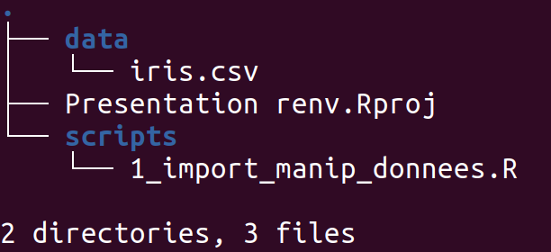
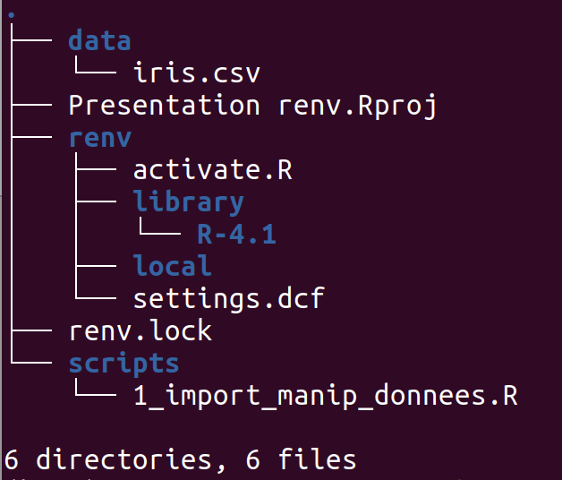
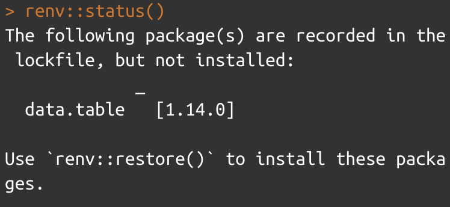
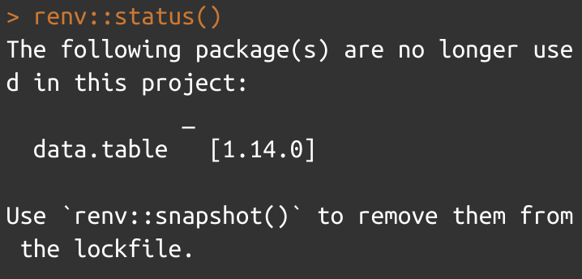

En 2019, je présentais brièvement le package `packrat` dans [un article de blog](https://antoinesir.rbind.io/post/gestion-des-packages-sur-r-pr%C3%A9sentation-de-packrat/). Ce package R permettait de gérer les dépendances aux packages d'un projet R à la manière des environnements de Python. Il comportait cependant un certain nombre d'inconvénients, dont celui d'un temps long de téléchargement des packages. Depuis 2020, il a été remplacé par `renv` qui gomme la plupart de ces défauts, et c'est l'occasion de vous montrer pourquoi et comment vous devriez vous servir d'un gestionnaire de packages pour vos projets R à partir d'un exemple concret!

[TOC]

On commence cet article par la présentation du projet dont on se sert comme exemple et de l'intérêt d'un gestionnaire de packages avant d'illustrer l'utilisation de `renv` dans ce contexte. Cet article a pour but de présenter un cas concret d'utilisation de `renv` mais ne se substitue pas à la [documentation officielle du package](https://rstudio.github.io/renv/articles/renv.html).  

# Intérêt d'un gestionnaire de packages dans un projet avec R   
La première étape pour aller vers plus de reproductibilité sur R est de connaître le fonctionnement des projets (fichiers .Rproj), qui permettent d'ouvrir R à la racine de votre projet et de proposer un code avec seulement des chemins relatifs. Si vous n'êtes pas du tout familiers avec ce fonctionnement, je vous conseille de lire [cet article](http://larmarange.github.io/analyse-R/organiser-ses-fichiers.html) de l'excellent blog de Joseph Larmarange.  

## Organisation du projet  
On propose pour illustrer le propos un projet tout simple dont l'organisation est présentée ci-dessous :  


Ce projet contient un dossier `data` dans lequel se trouve notre base de données et un dossier `scripts` avec un code R contenant quelques traitements basiques. À la racine du dossier, on remarque également notre fichier `Presentation renv.Rproj` qui définit donc l'emplacement de notre répertoire de travail. Le script R contient les instructions suivantes :  


```r
# Chargement des packages
library(dplyr)

# Import des données
mon_iris <- data.table::fread("data/iris.csv")

results <- mon_iris %>% 
  summarise(across(starts_with("Sepal"), mean)) 
```

Ce code tout simple permet donc de calculer la moyenne des largeur et longueur des sépales de la base de données `iris`. L'utilisation d'un fichier .Rproj, d'un chemin relatif pour importer les données et le fait que les deux packages utilisés (`dplyr` et `data.table`) soient chargés explicitement semblent rendre la reproductibilité des résultats aisée : il me suffit de récupérer l'ensemble du dossier, d'installer les deux packages s'ils ne sont pas déjà installés et de faire tourner le code. Seulement, je pourrais avoir sur mon poste une version de dplyr installée trop ancienne et dans laquelle `across` n'existerait pas encore. Bien sûr il suffirait ici de mettre à jour mon package, mais peut-être que la version la plus récente de `dplyr` ne correspond pas non plus à la version du code utilisé par la personne ayant écrit le code, et que cela peut causer de nouveaux problèmes...

## Avantages d'un gestionnaire de packages dans un projet R   

Tout d'abord, sachez qu'en général les développeurs de package R, et en particulier ceux ayant un très grand nombre d'utilisateurs, portent une attention particulière à faire en sorte que les mises à jour ne "cassent" pas les codes existants, en d'autres termes que ce qui a été codé dans une ancienne version du package tourne toujours avec la nouvelle version. Ceci étant dit, une mise à jour peut toujours avoir des conséquences sur vos résultats (anticipés ou non par les développeurs) et il est bien plus facile d'utiliser un gestionnaire de packages, et nous allons vous expliquer pourquoi.  

### Votre projet sera isolé  
Avec le système classique de packages R, tous les packages installés le sont dans un répertoire commun à votre ordinateur. Quand vous mettez à jour un package, l'ancienne version est écrasée et ce pour __tous__ vos projets. Ce que va permettre un gestionnaire de packages, c'est de faire dépendre une version d'un package à un projet en particulier. C'est ce qui va permettre à chacun de vos projets d'être __isolés__ les uns des autres. En plus, `renv` fonctionne sur un système de caches qui lui permet malgré tout de ne pas avoir à téléchargé deux fois la même version du même package si elle est utilisée dans deux projets différents. Cette propriété est particulièrement importante pour des gros projets pour lesquels vous n'auriez pas le temps d'adapter le code à une mise à jour d'un package, tout en voulant bénéficier de cette mise à jour pour vos autres travaux.  

### Votre projet sera portable et reproductible   
La portabilité d'un projet, c'est sa capacité à pouvoir tourner sur n'importe quelle machine, n'importe quel OS, etc... C'est ce qui permet sa reproductibilité, c'est-à-dire la capacité à reproduire les résultats dans des conditions identiques. C'est extrêmement précieux pour les projets en équipe mais aussi pour soi : en effet rien ne nous assure que notre projet codé il y a deux ans va tourner après les nombreuses mises à jour qu'ont dû subir les packages utilisés. `renv` permet de répondre à cette problématique en vous renvoyant 2 ans en arrière dans le même environnement de packages, à condition bien sûr que les versions utilisées alors soient encore disponibles sur le CRAN ou la source de laquelle vous les avez téléchargés.  

# Utilisation de renv  
Après, je l'espère, vous avoir convaincus de l'utilité d'un gestionnaire de packages, je vais vous présenter rapidement comment utiliser `renv` dans le petit projet que je vous ai présenté.  

## Initialisation de `renv`  
Pour commencer à utiliser le gestionnaire de packages, vous ouvrez votre projet dans RStudio et vous lancez dans la console `renv::init()`. Votre projet va maintenant ressembler à ça :  



On constate l'apparition d'un dossier `renv`, qui contient les fichiers de lancement et de paramétrage du gestionnaire ainsi que les liens vers les packages à charger. Contrairement à `packrat`, renv utilise en effet un cache dans lequel il installe les packages, ce qui permet de ne pas dupliquer l'installation de la même version du même package pour deux projets différents. Surtout, on constate l'apparition à la racine du projet du fichier `renv.lock`, qui ressemble à ça :  


```r
{
  "R": {
    "Version": "4.1.1",
    "Repositories": [
      {
        "Name": "CRAN",
        "URL": "https://cloud.r-project.org"
      }
    ]
  },
  "Packages": {
    "R6": {
      "Package": "R6",
      "Version": "2.5.0",
      "Source": "Repository",
      "Repository": "CRAN",
      "Hash": "b203113193e70978a696b2809525649d"
    },
    "cli": {
      "Package": "cli",
      "Version": "2.5.0",
      "Source": "Repository",
      "Repository": "CRAN",
      "Hash": "a94ba44cee3ea571e813721e64184172"
    },
    "crayon": {
      "Package": "crayon",
      "Version": "1.4.1",
      "Source": "Repository",
      "Repository": "CRAN",
      "Hash": "e75525c55c70e5f4f78c9960a4b402e9"
    },
    "data.table": {
      "Package": "data.table",
      "Version": "1.14.0",
      "Source": "Repository",
      "Repository": "CRAN",
      "Hash": "d1b8b1a821ee564a3515fa6c6d5c52dc"
    },...
```

Le gestionnaire a repéré les packages utilisés dans mon script et a recensé toutes leurs informations utiles ainsi que celles de leurs dépendances : nom, version, source d'installation... Il renseigne aussi les caractéristiques du logiciel R installé sur mon poste. C'est à partir de ce fichier que le gestionnaire va ensuite être capable de vérifier l'adéquation de l'environnement de packages de l'utilisateur et celui enregistré le plus récemment. C'est aussi là qu'il va écrire les références des packages que j'installerai après avoir commencé à travailler sur le poste.  

À noter que __`renv` peut aussi bien être utilisé au lancement de votre projet qu'au cours de celui-ci__. S'il est utilisé au lancement, vous enregistrerez les informations des packages au fur et à mesure de votre utilisation. Si le projet est déjà bien avancé comme dans notre exemple, il va noter les références des packages déjà installés et utilisés. 

## Mettre à jour les dépendances avec le fichier lock    
On présente les deux instructions les plus utiles de `renv` : `restore()` et `snapshot()`. C'est elles qui permettent de raccorder l'état de votre environnement de packages en local par rapport à celui qui sera proposé à l'ouverture de votre projet `renv`. C'est la fonction `status()` qui permet de vérifier que votre environnement de packages utilisé à un moment T correspond bien à celui enregistré dans le fichier lock.   

### Utilisation de `renv::restore()`  
Imaginons que j'ouvre ce même projet sur un autre poste sur lequel `data.table` n'est pas installé. En ouvrant le projet RStudio je vais avoir un message d'avertissement m'indiquant que mon environnement pourrait ne pas être à jour du projet. Je lance alors `renv::status()`, qui me renvoie en effet :  



L'absence d'installation de `data.table` a bien été repérée. Comme suggéré, il suffit de lancer `renv::restore()` pour que mon environnement de packages soit de nouveau à jour avec celui décrit dans le fichier lock. Il aurait fallu aussi envoyer cette instruction si la version de `data.table` enregistrée sur votre poste ne correspondait plus à celle enregistrée dans le fichier lock. Cette instruction sert donc à rendre mon environnement de packages en local cohérent avec celui renseigné dans le fichier lock.     

### Utilisation de `renv::snapshot()`  
Je peux aussi vouloir changer le fichier lock suite à une évolution du code. Imaginons par exemple que je n'utilise plus `data.table` pour importer mes données mais directement la fonction `read.csv()`, qui fait partie des fonctions chargées automatiquement au lancement de RStudio. Cette modification des dépendances va être repérée et `renv::status()` va renvoyer le message suivant :  

  

Si au contraire j'avais installé et utilisé un nouveau package, c'est la même instruction qui m'aurait permis d'ajouter ses références au fichier lock. `renv::snapshot()` permet donc de mettre à jour le fichier lock afin que mes modifications dans l'utilisation des packages soient prises en compte. Avant d'avoir lancé cette instruction, __les modifications dans mon utilisation des packages ne seront pas prises en compte par le gestionnaire de packages__.   

## Petite note sur git  
Comme on l'a vu, l'utilisation de `renv` est particulièrement intéressante dans le cadre d'un travail collaboratif. C'est donc naturellement qu'on l'utilisera avec git. Il est important de noter qu'il n'est nécessaire de ne versionner que le fichier lock pour cela. Le dossier `renv` contient en effet des informations spécifiques à chaque poste, comme les liens vers le cache ayant stocké les packages ionstallés.

# Conclusion  
Vous l'avez compris, `renv` est un outil très précieux pour s'assurer que d'autres personnes ou vous-même pourront refaire tourner votre code sans difficultés. Il est sans doute nécessaire, mais pas suffisant : certains packages dépendent aussi d'autres packages comme javascript, il faut bien sûr veiller à ce que les données en entrée soient les mêmes et que les scripts ne contiennent pas de paramètres spécifiques à un utilisateur.  
En plus des qualités présentées dans l'article, `renv` vous permettra aussi de vous rendre compte du nombre de packages sur lequel repose votre projet, qui ne se limitent pas qu'aux packages installés mais aussi à leurs dépendances. Cela peut être une bonne occasion d'essayer de réduire ces dépendances dans la mesure du possible. Un exemple du type de problèmes que de trop nombreuses dépendances peuvent causer est le frisson qui a parcouru les quelques milliers de développeurs de packages R dépendant du package `lubridate` quand ils ont reçu un mail du CRAN leur annonçant que ce dernier risquait d'être supprimé et qu'ils devaient ajuster leurs packages en conséquence. Bien sûr et naturellement vue la popularité de `lubridate`, cela [n'arrivera finalement pas](https://twitter.com/dvaughan32/status/1445459240718458881), mais c'est un rappel intéressant qu'il y a des développeurs et beaucoup de travail dont nous dépendons tous quand nous utilisons un package.
