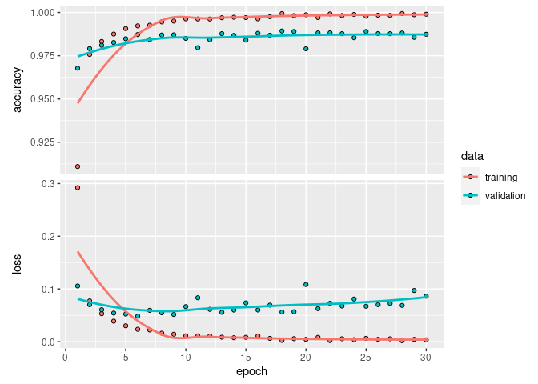

# Présentation de la librairie Keras

## Origine de la librairie

Keras est une API Python qui permet de créer et entraîner des modèles de Deep Learning. Elle a l'avantage d'offrir une interface simple et une syntaxe claire. Elle permet également d'accéder à de nombreux modèles pré-entraînés qui peuvent ensuite facilement être _fine-tunés_ sur d'autres données. Elle a été récemment intégrée à `TensorFlow` mais peut s'appuyer sur d'autres backends.

Keras dispose aussi d'une [documentation très complète](https://keras.io/api/), et sa popularité permet de retrouver de nombreux exemples d'utilisation en ligne. Elle est le plus souvent utilisée grâce au package Python `keras` ou via TensorFlow avec `tf.keras`, qui permettent d'exploiter facilement ses différentes méthodes.   

## Installation du package sur R  

Grâce notamment à la puissance de `reticulate`, un package permettant de faire tourner Python depuis une session R, on dispose maintenant d'un package R `keras`, que nous vous présentons ici. Nous utiliserons la dernière version disponible, le package `keras3`. La première étape est bien sur d'installer le package avec `install.packages("keras3")` puis de lancer la fonction `keras3::install_keras()` qui permet d'installer Python et un environnement anaconda dédié.


```r
library(keras3)
install_keras()
```

Si vous avez du GPU, vous pouvez vérifier que votre devise a bien été repérée avec l'instruction suivante (normalement, `tensorflow` a été installé au moment de l'installation de `keras3`) :    


```r
tensorflow::tf$config$list_physical_devices("GPU")
```

```
## [[1]]
## PhysicalDevice(name='/physical_device:GPU:0', device_type='GPU')
```

# Entraîner un premier réseau convolutionnel

Pour notre petite démonstration, nous allons utiliser la célébrissime base de données `mnist` qui contient des images de chiffres écrits à la main. Le but est donc de développer un modèle capable de reconnaître les chiffres manuscrits.  

## Pré-traiter vos données

Les données sont fournies avec 60 000 observations pour les données d'entraînements et 10 000 pour les données de test. Les images étant renseignées directement sous forme de matrice dans le package `keras3` nous n'avons besoin que de normaliser ces matrices sur [0, 1]. On passe aussi la variable d'intérêt, qui donne la valeur du chiffre en question, sous un one-hot-encoder avec la fonction `to_categorical`. On obtient ainsi un vecteur de taille 10 avec 0 ou 1 pour chacune des positions. 


```r
library(keras3)

mnist <- dataset_mnist()
x_train <- mnist$train$x
y_train <- mnist$train$y
x_test<- mnist$test$x
y_test <- mnist$test$y

# on normalise sur [0, 1]
x_train <- x_train/255
x_test <- x_test/255

# one-hot-encoder pour la variable d'intérêt avec to_categorical
y_train <- to_categorical(y_train, num_classes = 10)
y_test <- to_categorical(y_test, num_classes = 10)
```

## Initialiser et définir votre réseau de neurones profond  

On initialise le modèle avec `keras_model_sequential`, dans lequel on précise d'emblée la dimension des données que le modèle prendra en entrée. Puis on ajoute les différentes couches de neurones.  

Comme nous sommes dans un réseau convolutionnel, on commence directement par une couche de convolution, qui permet de faire ressortir les caractéristiques de chaque image. Cela fonctionne grâce à un système de filtre, réalisé en faisant le produit de la matrice de pixels et d'une matrice plus petite, appelée `feature detector`. On définit dans cette étape le nombre de filtres que l'on souhaite faire passer avec le paramètre `filters` et la taille de la matrice `feature detector` avec le paramètre `kernel_size`.   

On applique ensuite aux matrices obtenues une couche de **max pooling** qui permet de réduire les dimensions du problème en ne conservant que les valeurs les plus importantes. Cette étape permet aussi de rendre plus souvent comparables des images ayant des caractéristiques semblables à des endroits différents de l'image. Le paramètre `pool_size` permet de choisir la taille du sous-ensemble sur lequel on ne va garder que la valeur maximale. 

On peut ensuite refaire des nouvelles couches de convolution suivies de pooling, en fonction de la complexté et de la taille de nos matrices de pixel en entrée du modèle. On termine ces étapes par une couche `flatten()` qui permet d'obtenir un input en deux dimensions sur lequel on va pouvoir construire notre réseau de neurones profond avec des couches `dense()`. On choisit ici une couche avec 128 neurones, suivie d'une couche avec 64 neurones. la couche de sortie contient 10 neurones correspondant aux 10 classes possibles.

Le package R `keras3` permet une syntaxe très proche de celle que l'on utiliserait sur Python. On peut en plus relier ces couches avec l'opérateur `|>`, rendant le code encore plus lisible et aéré : 


```r
# Initialisation du modèle  
my_first_r_cnn <- keras_model_sequential(input_shape = c(28,28,1))


my_first_r_cnn |> 
  # convolution et max pooling
  layer_conv_2d(filters = 32, kernel_size = c(3, 3), 
                # l'activation relu "casse" une linéarité qui a pu
                # être introduite avec la convolution
                activation = 'relu') |> 
  layer_max_pooling_2d(pool_size = c(2, 2)) |> 
  layer_conv_2d(filters = 16, kernel_size = c(2, 2), 
                activation = 'relu') |> 
  layer_max_pooling_2d(pool_size = c(2, 2)) |> 
  layer_flatten() |> 
  layer_dense(units = 128, activation = 'relu') |> 
  layer_dense(units = 64, activation = 'relu') |> 
  layer_dense(units = 10, activation = 'softmax')
```

On peut illustrer la structure de notre modèle avec la fonction `summary()` : 


```r
summary(my_first_r_cnn)
```

```
## Model: "sequential"
## ┏━━━━━━━━━━━━━━━━━━━━━━━━━━━━━━━━━━━┳━━━━━━━━━━━━━━━━━━━━━━━━━━┳━━━━━━━━━━━━━━━┓
## ┃ Layer (type)                      ┃ Output Shape             ┃       Param # ┃
## ┡━━━━━━━━━━━━━━━━━━━━━━━━━━━━━━━━━━━╇━━━━━━━━━━━━━━━━━━━━━━━━━━╇━━━━━━━━━━━━━━━┩
## │ conv2d (Conv2D)                   │ (None, 26, 26, 32)       │           320 │
## ├───────────────────────────────────┼──────────────────────────┼───────────────┤
## │ max_pooling2d (MaxPooling2D)      │ (None, 13, 13, 32)       │             0 │
## ├───────────────────────────────────┼──────────────────────────┼───────────────┤
## │ conv2d_1 (Conv2D)                 │ (None, 12, 12, 16)       │         2,064 │
## ├───────────────────────────────────┼──────────────────────────┼───────────────┤
## │ max_pooling2d_1 (MaxPooling2D)    │ (None, 6, 6, 16)         │             0 │
## ├───────────────────────────────────┼──────────────────────────┼───────────────┤
## │ flatten (Flatten)                 │ (None, 576)              │             0 │
## ├───────────────────────────────────┼──────────────────────────┼───────────────┤
## │ dense (Dense)                     │ (None, 128)              │        73,856 │
## ├───────────────────────────────────┼──────────────────────────┼───────────────┤
## │ dense_1 (Dense)                   │ (None, 64)               │         8,256 │
## ├───────────────────────────────────┼──────────────────────────┼───────────────┤
## │ dense_2 (Dense)                   │ (None, 10)               │           650 │
## └───────────────────────────────────┴──────────────────────────┴───────────────┘
##  Total params: 85,146 (332.60 KB)
##  Trainable params: 85,146 (332.60 KB)
##  Non-trainable params: 0 (0.00 B)
```


## Entraîner et évaluer les performances de votre modèle

La première étape est de compiler l'objet créé précédemment, en définissant l'_optimizer_ qui sera utilisé, la fonction de perte et la métrique sur laquelle on souhaite optimiser le résultat du modèel :  
  


```r
compile(my_first_r_cnn,
        optimizer = 'adam',
        loss = 'categorical_crossentropy',
        metrics = 'accuracy') 
```

Ensuite, on peut lancer l'entraînement avec une instruction `fit()` que l'on applique à nos données d'entraînement. On y définit notamment le paramètre `batch_size` qui permet de déterminer combien d'images le modèle va traiter avant d'ajuster ses coefficients. Le paramètre `epochs` définit le nombre de fois où le modèle passe sur toutes les données. Enfin, on split nos données d'entraînement en conservant 30% comme données de validation afin de d'évaluer correctement les performances de notre modèle :  


```r
history <- my_first_r_cnn %>% fit(
  x_train, y_train,
  epochs = 30,
  batch_size = 64,
  validation_split = 0.3)
```

```
## Epoch 1/30
## 657/657 - 6s - 9ms/step - accuracy: 0.9110 - loss: 0.2921 - val_accuracy: 0.9678 - val_loss: 0.1056
## Epoch 2/30
## 657/657 - 1s - 2ms/step - accuracy: 0.9757 - loss: 0.0773 - val_accuracy: 0.9791 - val_loss: 0.0702
## Epoch 3/30
## 657/657 - 1s - 2ms/step - accuracy: 0.9832 - loss: 0.0531 - val_accuracy: 0.9810 - val_loss: 0.0606
## Epoch 4/30
## 657/657 - 1s - 2ms/step - accuracy: 0.9875 - loss: 0.0389 - val_accuracy: 0.9826 - val_loss: 0.0543
## Epoch 5/30
## 657/657 - 1s - 2ms/step - accuracy: 0.9906 - loss: 0.0301 - val_accuracy: 0.9848 - val_loss: 0.0523
## Epoch 6/30
## 657/657 - 1s - 2ms/step - accuracy: 0.9922 - loss: 0.0235 - val_accuracy: 0.9872 - val_loss: 0.0484
## Epoch 7/30
## 657/657 - 1s - 2ms/step - accuracy: 0.9926 - loss: 0.0222 - val_accuracy: 0.9843 - val_loss: 0.0595
## Epoch 8/30
## 657/657 - 1s - 2ms/step - accuracy: 0.9945 - loss: 0.0161 - val_accuracy: 0.9869 - val_loss: 0.0548
## Epoch 9/30
## 657/657 - 1s - 2ms/step - accuracy: 0.9950 - loss: 0.0141 - val_accuracy: 0.9871 - val_loss: 0.0516
## Epoch 10/30
## 657/657 - 1s - 2ms/step - accuracy: 0.9963 - loss: 0.0111 - val_accuracy: 0.9850 - val_loss: 0.0665
## Epoch 11/30
## 657/657 - 1s - 2ms/step - accuracy: 0.9962 - loss: 0.0110 - val_accuracy: 0.9796 - val_loss: 0.0833
## Epoch 12/30
## 657/657 - 1s - 2ms/step - accuracy: 0.9962 - loss: 0.0107 - val_accuracy: 0.9842 - val_loss: 0.0614
## Epoch 13/30
## 657/657 - 1s - 2ms/step - accuracy: 0.9969 - loss: 0.0085 - val_accuracy: 0.9877 - val_loss: 0.0557
## Epoch 14/30
## 657/657 - 1s - 2ms/step - accuracy: 0.9972 - loss: 0.0074 - val_accuracy: 0.9867 - val_loss: 0.0600
## Epoch 15/30
## 657/657 - 1s - 2ms/step - accuracy: 0.9970 - loss: 0.0082 - val_accuracy: 0.9840 - val_loss: 0.0736
## Epoch 16/30
## 657/657 - 1s - 2ms/step - accuracy: 0.9963 - loss: 0.0108 - val_accuracy: 0.9879 - val_loss: 0.0602
## Epoch 17/30
## 657/657 - 1s - 2ms/step - accuracy: 0.9975 - loss: 0.0062 - val_accuracy: 0.9868 - val_loss: 0.0694
## Epoch 18/30
## 657/657 - 1s - 2ms/step - accuracy: 0.9993 - loss: 0.0024 - val_accuracy: 0.9893 - val_loss: 0.0562
## Epoch 19/30
## 657/657 - 1s - 2ms/step - accuracy: 0.9982 - loss: 0.0056 - val_accuracy: 0.9890 - val_loss: 0.0568
## Epoch 20/30
## 657/657 - 1s - 2ms/step - accuracy: 0.9987 - loss: 0.0043 - val_accuracy: 0.9790 - val_loss: 0.1084
## Epoch 21/30
## 657/657 - 1s - 2ms/step - accuracy: 0.9970 - loss: 0.0081 - val_accuracy: 0.9882 - val_loss: 0.0627
## Epoch 22/30
## 657/657 - 1s - 2ms/step - accuracy: 0.9991 - loss: 0.0021 - val_accuracy: 0.9882 - val_loss: 0.0728
## Epoch 23/30
## 657/657 - 1s - 2ms/step - accuracy: 0.9982 - loss: 0.0055 - val_accuracy: 0.9877 - val_loss: 0.0676
## Epoch 24/30
## 657/657 - 1s - 2ms/step - accuracy: 0.9988 - loss: 0.0038 - val_accuracy: 0.9854 - val_loss: 0.0809
## Epoch 25/30
## 657/657 - 1s - 2ms/step - accuracy: 0.9978 - loss: 0.0063 - val_accuracy: 0.9890 - val_loss: 0.0672
## Epoch 26/30
## 657/657 - 1s - 2ms/step - accuracy: 0.9984 - loss: 0.0044 - val_accuracy: 0.9878 - val_loss: 0.0702
## Epoch 27/30
## 657/657 - 1s - 2ms/step - accuracy: 0.9983 - loss: 0.0054 - val_accuracy: 0.9877 - val_loss: 0.0725
## Epoch 28/30
## 657/657 - 1s - 2ms/step - accuracy: 0.9994 - loss: 0.0018 - val_accuracy: 0.9881 - val_loss: 0.0688
## Epoch 29/30
## 657/657 - 1s - 2ms/step - accuracy: 0.9987 - loss: 0.0043 - val_accuracy: 0.9856 - val_loss: 0.0971
## Epoch 30/30
## 657/657 - 1s - 2ms/step - accuracy: 0.9990 - loss: 0.0034 - val_accuracy: 0.9874 - val_loss: 0.0862
```

On peut illustrer l'évolution de la qualité du modèle au fur et à mesure des epochs avec `plot` :  


```r
plot(history)
```

<!-- -->

Enfin, on sort la performance du modèle sur nos données test avec `evaluate` :  


```r
accuracy_test <- my_first_r_cnn |> evaluate(x_test, y_test)
```

```
## 313/313 - 1s - 4ms/step - accuracy: 0.9879 - loss: 0.0645
```

```r
print(accuracy_test)
```

```
## $accuracy
## [1] 0.9879
## 
## $loss
## [1] 0.06453101
```

> Inutile bien sûr de préciser que nous sommes dans un cas de classification relativement simple et avec énormément de données de bonne qualité, donc ne cherchez pas à atteindre de tels niveaux de précision sur des données un peu plus compliquées! 

# Prédictions à partir du modèle pré-entraîné  

Prenons par exemple la 20e image de l'échantillon test : 


```r
index <- 20 # On prend la 20e image"
image_data <- x_test[index,,]  # Sélection de l'image
label <- mnist$test$y[index]  # Label associé

# Inverser les couleurs pour un affichage correct
image_data <- t(apply(image_data, 2, rev))

# Afficher l'image en niveaux de gris
image(image_data, col = gray((0:255)/255), main = paste("Label :", label),
      axes = FALSE, asp = 1)
```

<!-- -->

On peut sortir les prédictions des probabilités associées à chaque classe avec la fonction `predict()`. La prédiction associée à l'image précédente donne le résultat suivant :  


```r
# On prédit l'ensemble des X_test
matrice_pred <- my_first_r_cnn |> predict(x_test)
```

```
## 313/313 - 1s - 3ms/step
```

```r
# On sort l'index max - 1 (qui correspond à la classe) de l'observation n°20
pred_obs <- which.max(matrice_pred[20,]) - 1

image(image_data, col = gray((0:255)/255), main = paste("Label :", label, 
                                                        "Prédiction :", pred_obs),
      axes = FALSE, asp = 1)
```

<!-- -->


# Deep Learning avec R ou Python?  

Le package `keras3` est très complet et semble offrir autant de possibilités que le module Python. Il dispose aussi d'une [documentation complète et très détaillée](https://keras3.posit.co). Cependant, il faut garder en tête qu'il fait tourner Python en arrière-plan.   

Le gros avantage pour un utilisateur non aguerri de Python est que le package `keras3` va gérer pour vous l'environnement anaconda et les dépendances, qui peuvent être un vrai casse-tête quand on se met à Python. Enfin, la syntaxe très proche de celle de Python peut vous permettre de commencer à vous accoutumer en vue d'une future utilisation de Python, tout en restant sur votre langage favori en attendant!  

Enfin, on peut imaginer que l'utilisation d'un package R peut être très pratique dans le cadre de la mise en oeuvre de méthodes de statistiques inférentielles sur des prédictions de modèles de Machine Learning, comme par exemple dans [ce papier très intéressant](https://www.science.org/doi/10.1126/science.adi6000).


