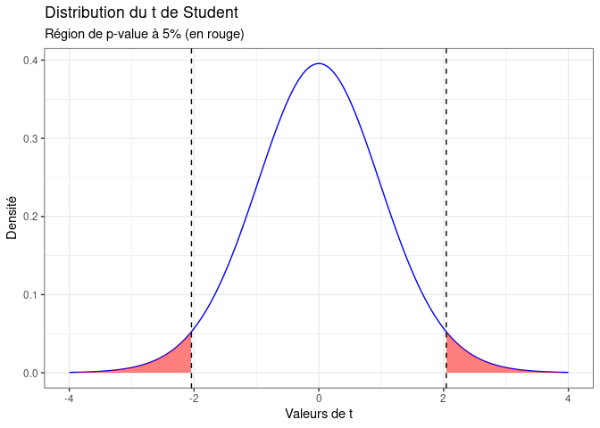
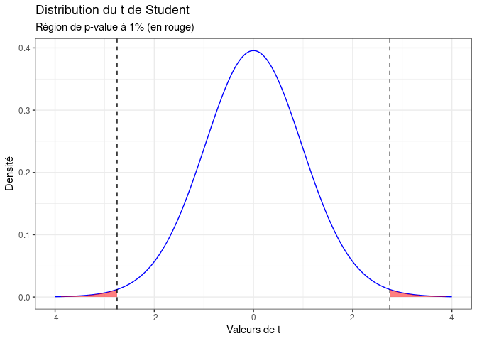

[TOC]\  

Aujourd'hui c'est à un grand classique de la statistique que l'on s'attaque : la __p-value, ou p valeur__. Fondamentale dans l'interprétation des résultats de la littérature scientifique, elle est pourtant __souvent mal interprétée__. C'est sur elle que l'on s'appuie pour __confirmer ou infirmer une hypothèse__ et juger de la __significativé de nos résultats__. Mais qu'est-ce que cela implique et comment bien appréhender ce qu'elle permet (et surtout ce qu'elle ne permet pas) de conclure? On essaye de voir ça ensemble, comme toujours de la manière la plus intuitive possible!  

# Les p-values et les tests statistiques  

Pour comprendre les p-values, il faut aborder la notion de __tests statistiques__. Ces tests permettent de tester une __Hypothèse nulle `H0`__ contre une __hypothèses alternative `H1`__. Par exemple, dans le cas d'une régression linéaire, on utilise le test t de student qui nous permet de tester pour chaque coefficient   \(\beta_i\) :  
- `H0` : \(\beta_i  = 0\)  

Le principe du test est le suivant : on va __partir du principe que H0 est vrai__ et on va voir si __le résultat que l'on obtient est vraisemblable__ dans ce monde théorique. Ce test statistique va ainsi nous donner la __distribution possible des résultats que l'on pourrait obtenir avec notre échantillon si `H0` était vraie__. Selon où l'on se situe dans cette distribution, on va pouvoir juger de la __vraisemblance de cette hypothèse H0__, en fonction d'un __seuil alpha que l'on peut faire varier__ :  

<!-- -->

En fonction de la valeur de t obtenue dans notre échantillon, on peut juger de la vraisemblance de l'hypothèse `H0`. Sur le graphique ci-dessus par exemple, si la valeur obtenue est dans la zone rouge on sait que __cela représenterait 5% ou moins des résultats possibles que l'on aurait obtenus si `H0` était vraie__. On juge donc que __la nullité du coefficient est peu vraisemblable__.  

Bien sûr, si on modifie le seuil alpha dans un sens plus restrictif, en jugeant par exemple qu'on ne considérera un coefficient significatif seulement s'il l'est à 1%, cela va restreindre la zone rouge de notre graphique :  

<!-- -->

Ainsi, lorsqu'on fait tourner un modèle de régression sur notre logiciel de statistiques favori et que l'on obtient une p-value, il s'agit du seuil de vraisemblance maximum de notre hypothèse `H0`. On va donc l'interpréter comme __la vraisemblance que notre coefficient soit différent de zéro__, ou encore comme la __significativité de ce coefficient__. 

# Interprétation des p-values

Il faut bien comprendre que la p-value et la __significativité du coefficient__ qui en découle ne porte que sur la question de savoir si ce coefficient est ou non différent de zéro. Cela n'indique pas si le résultat trouvé a une importance particulière. Un coefficient peut très bien être __significatif statistiquement__ (donc différent de zéro très probablement) mais __en pratique insignifiant__.  
De plus, un résultat peut être non significatif en raison d'une mauvaise calibration du modèle : un échantillon trop peu important, de trop nombreuses variables explicatives, etc... C'est notamment pour cette raison qu'il __ne faut pas directement interpréter un coefficient non significatif comme un absence d'effet__. C'est plutôt une absence de preuve d'effet. Oui, c'est moins facile à rédiger, mais cela rend plus justice à la complexité des statistiques inférentielles.  
En général, le consensus scientifique fixe le __seuil de significativité à 5%__. Bien sûr, c'est forcément au moins partiellement arbitraire et cela pose question : on écarterait un résultat avec une p-value avec 5,1% mais on afficherait fièrement celui avec une p-value à 4,9%? Cela pose forcément des problèmes.  
Il est ainsi tentant pour les chercheurs de construire leur modèle en fonction de la p-value recherchée, et non de la question de recherche affichée, ce qui est complètement contre-productif. D'autant que la nature de la p-value fait que si l'on teste suffisamment de fois, on finira bien par trouver des résultats significatifs uniquement du fait du hasard. Cette mauvaise pratique est bien identifiée et se nomme le [p-hacking](https://en.wikipedia.org/wiki/Data_dredging). La bonne manière de se prémunir de cet écueil est de __définir la question de recherche et les modèles statistiques en amont de la collecte de données__ et de calibrer l'échantillon en fonction de ceux-ci. Il faut ensuite tâcher de ne pas s'écarter de ces axes de recherche...même si on n'obtient pas les p-values qu'on espérait!  

# Conclusion   

La p-value, ça n'est donc pas du tout la _probabilité que le coefficient soit incorrect_! Dans le cas d'une régression, c'est un indicateur de la vraisemblance que celui-ci soit différent de zéro. Mais un coefficient significatif peut aussi avoir une estimation très imprécise, ou une valeur insignifiante. Il est donc fondamental d'affiner son diagnostic, avec par exemple les intervalles de confiance, et surtout l'interprétation de quelqu'un qui comprend les implications pratiques d'un coefficient!  

C'est tout pour aujourd'hui! N'hésitez pas à [visiter notre site (qui a fait peau neuve, vous avez remarqué?)](https://www.statoscop.fr) et à nous suivre sur [Twitter](https://twitter.com/stato_scop) et [Linkedin](https://www.linkedin.com/company/statoscop). Pour retrouver le code ayant servi à générer cette note, vous pouvez vous rendre sur le [github de Statoscop](https://github.com/Statoscop/notebooks-blog).  
